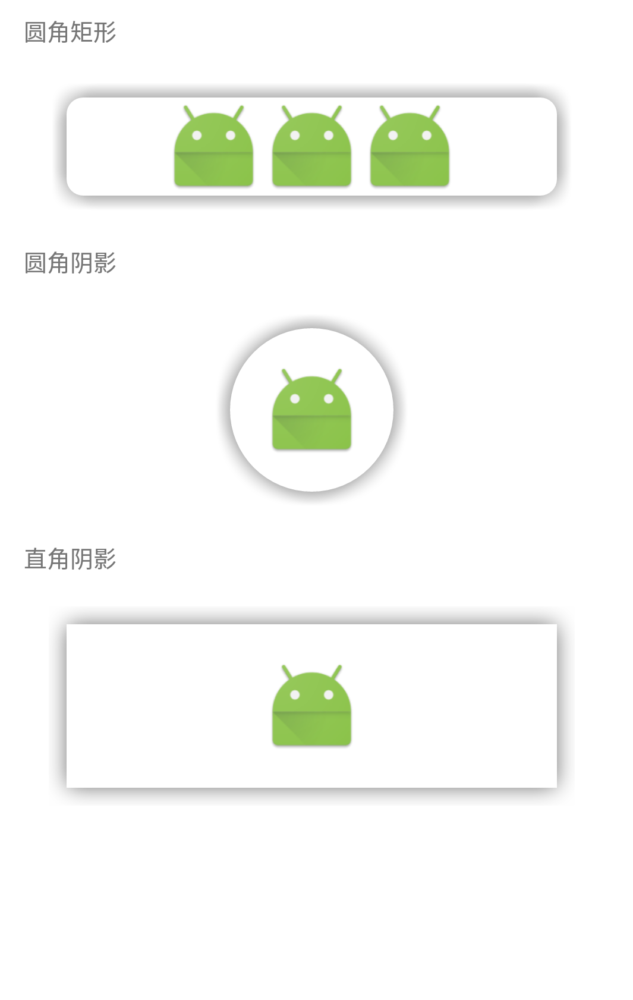

android阴影效果，参考这位大佬的[ShadowLayout](https://github.com/lijiankun24/ShadowLayout)
但是也是有问题和局限性，比如不支持圆角阴影，对layout做阴影偏移之后就会显示透明背景，影响显示效果，
所以我在他的基础上再做修改，改的地方后面会很多，所以就重新开了个项目，慢慢新增功能，打算做一个比较
全面的功能库，以后直接拿来直接使用。之后如果看到比较好的实现方式也会拿来使用的，会把这个库给做完善，
方便后续同学继续使用，自己以前做阴影效果也是花费了很多时间的。

## 目前已有的功能

* 1. 矩形阴影
* 2. 圆行阴影
* 3. 圆角阴影
* 4. 左右和上下阴影偏移
* 5. 子元素可以设置match_parent

## 不支持功能和局限性

* 1. 单边设置阴影
* 2. KShadow暂且对Margin和Padding处理

## 显示效果

    

